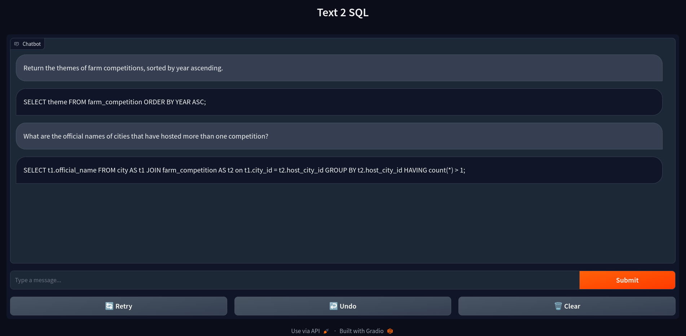

## Text2SQL

<p>
The Interactive SQL Query Generator is a powerful tool that harnesses the capabilities of the FLAN T5 (base) model to assist users in crafting complex SQL queries effortlessly.
</p>



## To run the application locally:

<p>

 ```
 git clone https://github.com/Chandrahas-B/Text2SQL.git
 cd Text2SQL
 ```


Model: <a href= "https://drive.google.com/drive/folders/1b5H3sI4sEN69aPcuXS3YbJGfrXhZ_F0k?usp=sharing"> Click here </a>

Tokenizer: <a href= "https://drive.google.com/drive/folders/1b5H3sI4sEN69aPcuXS3YbJGfrXhZ_F0k?usp=sharing"> Click here </a>

- Using pip:
```
pip install -r requirements.txt
python main.py
```

- Using conda:
```
conda env create -f environment.yml
python main.py
```

- Using docker:
```
docker pull chandrahasb/projects:text2sql
docker run -d --name text2sql -p 7860:7860 chandrahasb/projects:text2sql
```
- Using docker compose:
```
docker compose up
```
</p>